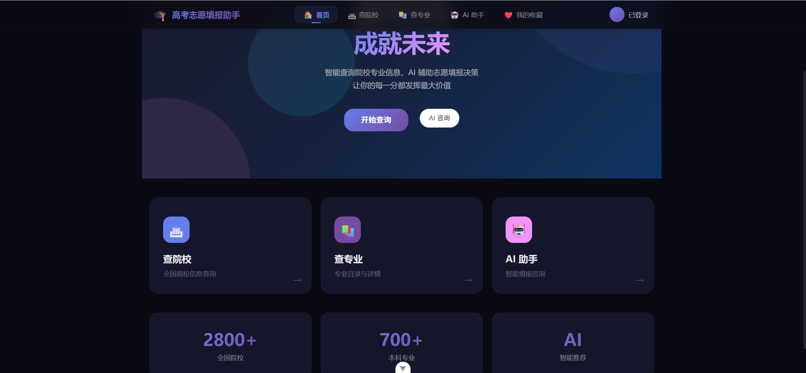
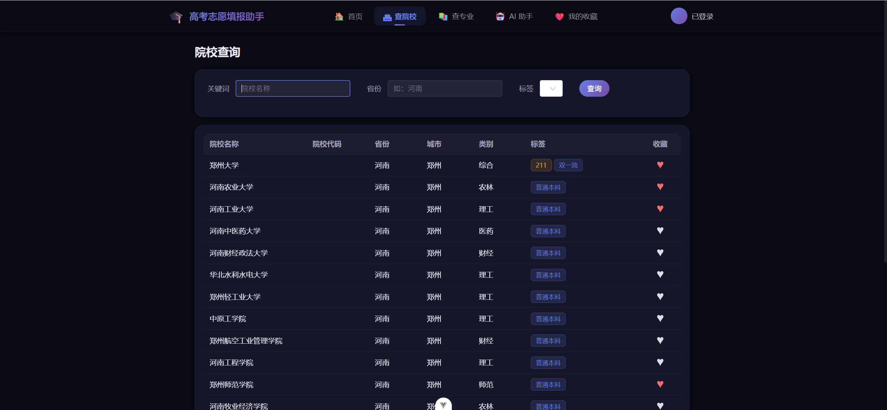
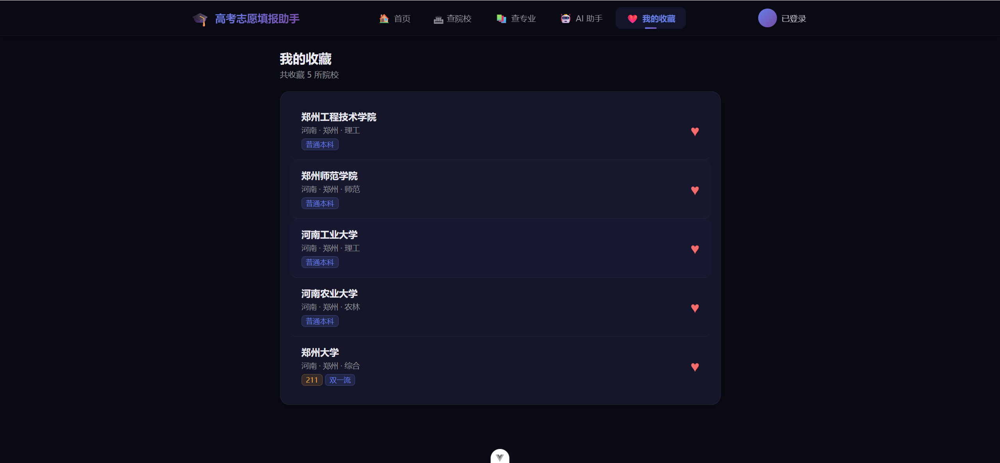
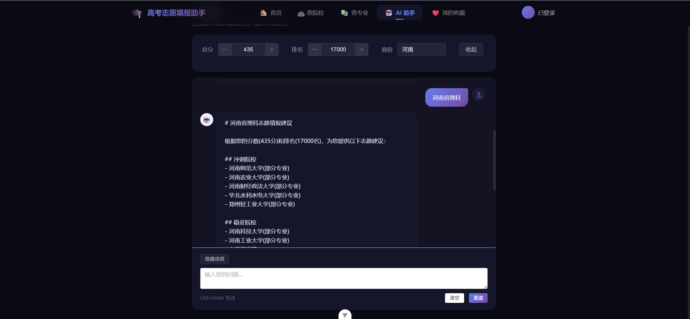
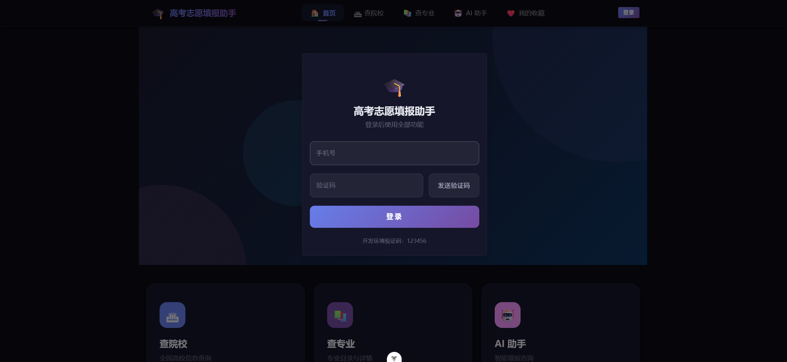

# 高考志愿填报系统 - Web 前端

> 基于 Vue 3 + Vite + Element Plus 构建的响应式前端，提供院校/专业查询、AI 智能问答、志愿推荐、收藏等功能。

## 相关项目

- **后端 API**：https://github.com/lvmou-123/gaokao_school_project
- **微信小程序**：https://github.com/lvmou-123/gaokao_school_project-app

## 功能特性

| 模块 | 说明 |
|------|------|
| 🏛 院校查询 | 按关键词、省份、标签（985/211/双一流）筛选全国高校信息 |
| 📚 专业查询 | 按关键词、学科门类查询专业目录与详情 |
| 🤖 AI 助手 | 智能高考志愿填报问答，支持添加成绩/排名/省份上下文 |
| 🎯 智能推荐 | 院校详情页一键获取冲刺/稳妥/保底志愿建议 |
| ❤ 院校收藏 | 收藏心仪院校，方便对比与决策 |
| 📱 手机登录 | 短信验证码快速登录 |

## 技术栈

- **框架**：Vue 3（组合式 API + `<script setup>`）
- **构建工具**：Vite
- **UI 组件库**：Element Plus
- **路由**：Vue Router 4
- **状态管理**：Pinia
- **HTTP 请求**：Axios
- **类型检查**：TypeScript + vue-tsc
- **单元测试**：Vitest
- **E2E 测试**：Playwright
- **代码规范**：ESLint + Oxlint

## 页面展示

| 页面 | 截图 |
|------|------|
| 首页 |  |
| 院校查询 |  |
| 专业查询 |  |
| AI 助手 |  |
| 登录页面 |  |

## 快速开始

```sh
# 安装依赖
npm install

# 启动开发服务器
npm run dev

# 构建生产版本
npm run build

# 预览构建产物
npm run preview
```

## 开发命令

```sh
# 类型检查
npm run type-check

# 单元测试
npm run test:unit

# E2E 测试（需先构建）
npm run build
npm run test:e2e

# 代码检查
npm run lint
```

## 后端接口同步

后端接口变更后，执行以下命令拉取最新 OpenAPI 文档并重新生成 API 代码：

```sh
npm run sync:api
```

> 禁止手动修改 `src/api/api.ts` 及 `src/api/data-contracts.ts`，所有修改应通过后端 OpenAPI 文档同步。
